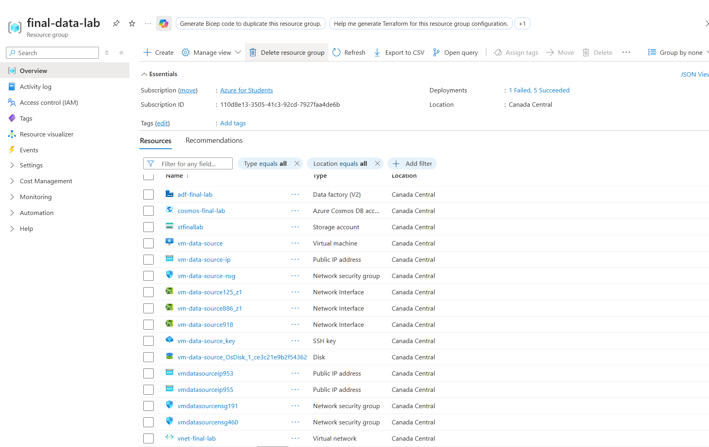
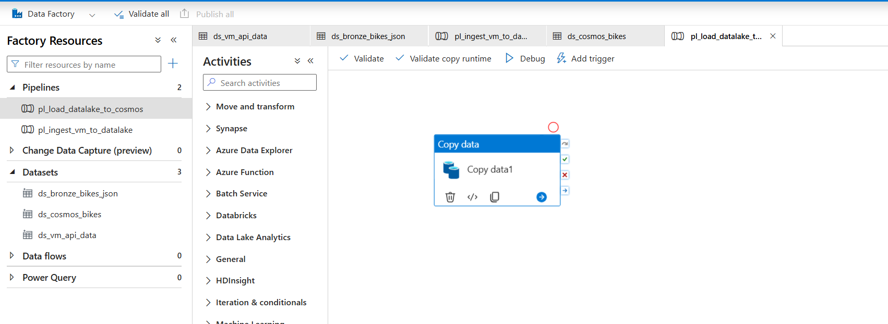
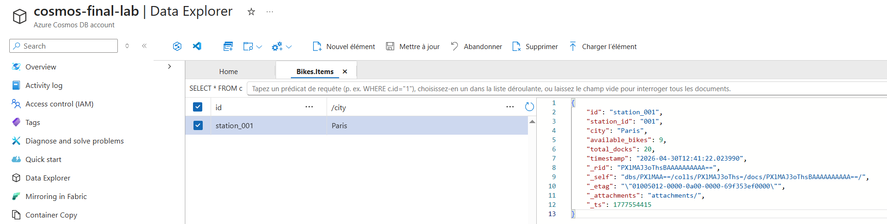

# Azure End-to-End Data Engineering: Real-Time IoT Ingestion

This repository contains the architecture and configuration for a scalable data pipeline built on Microsoft Azure. The project simulates a real-world IoT scenario, ingesting bike-sharing telemetry data from a custom API into a cloud-native serving layer.

## Architecture

The solution implements a **Medallion Architecture**:
*   **Producer**: Python Flask API hosted on an **Azure Ubuntu VM**.
*   **Bronze (Raw)**: Ingested as immutable JSON blobs in **Azure Data Lake Storage Gen2** with unique timestamps to preserve history[cite: 3].
*   **Serving Layer**: High-velocity data served via **Azure Cosmos DB (NoSQL)** for application consumption[cite: 4, 7].

## Tech Stack & Resource Inventory
The entire solution was deployed in the `Canada Central` region[cite: 1, 2]. 

**Provisioned Resources:**

*   **Orchestration**: Azure Data Factory (ADF) `adf-final-lab`[cite: 1]
*   **Storage**: ADLS Gen2 `stfinallab`[cite: 5]
*   **Database**: Cosmos DB `cosmos-final-lab`[cite: 6]
*   **Compute**: Linux VM `vm-data-source`
*   **Networking**: VNet, NSGs, and Public IPs for secure connectivity.

## Pipeline Implementation

### Ingestion Logic
The pipeline `pl_ingest_vm_to_datalake` performs a GET request to the VM endpoint. To ensure data is never overwritten, I implemented a dynamic naming convention in the Sink dataset:
`@concat('bikes_', formatDateTime(utcNow(), 'yyyyMMdd_HHmmss'), '.json')`[cite: 3]

### Loading to Serving Layer
The pipeline `pl_load_datalake_to_cosmos` processes the raw files using a wildcard pattern (`*.json`) and maps them to the Cosmos DB schema[cite: 7].

**Pipeline Design:**

*(Screenshot of the ADF Copy Activity orchestration)*[cite: 1, 7]

## 📊 Results & Verification
The final output is stored in Cosmos DB, partitioned by `city` for optimized query performance[cite: 4].

**Data Explorer Preview:**

*(Live document in Cosmos DB showing telemetry for station_001)*[cite: 7]

## Repository Structure
*   `/factory/pipelines/`: JSON definitions for the ADF pipelines[cite: 7].
*   `/factory/datasets/`: Definitions for ADLS and Cosmos DB datasets[cite: 3, 4].
*   `/factory/linkedServices/`: Connection metadata[cite: 5, 6].
*   `app.py`: Python script used to simulate the bike station API.
